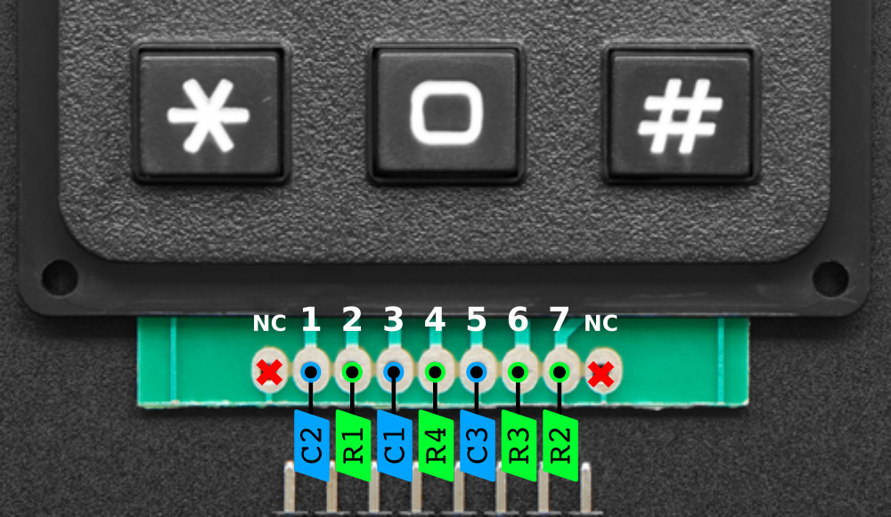
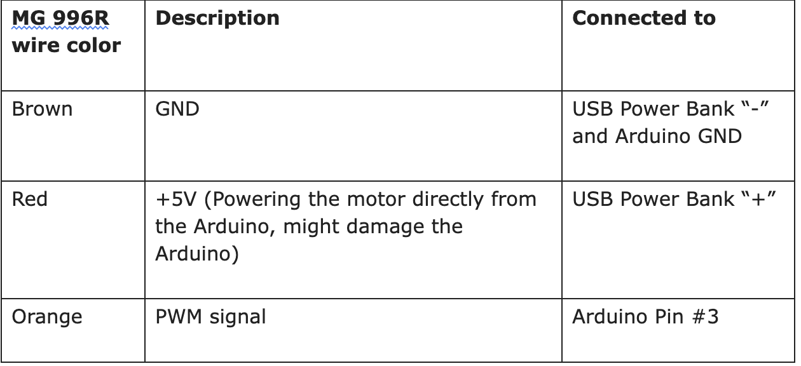
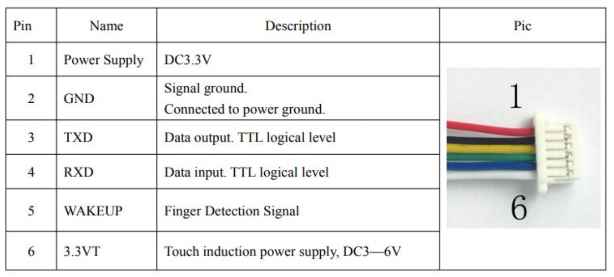

# Fingerprint ID Safe with Keypad

The Fingprint ID Safe with keypad is a two step-vertification safe that only unlocks after the right finerprint and right passcode are entered. This project was inspired by my front door lock.

<!--Replace this text with a brief description (2-3 sentences) of your project. This description should draw the reader in and make them interested in what you've built. You can include what the biggest challenges, takeaways, and triumphs from completing the project were. As you complete your portfolio, remember your audience is less familiar than you are with all that your project entails!
-->

| **Engineer** | **School** | **Area of Interest** | **Grade** |
|:--:|:--:|:--:|:--:|
| Timothy Y | Redwood High School | Engineering | Incoming Junior

<!-- **Replace the BlueStamp logo below with an image of yourself and your completed project. Follow the guide [here](https://tomcam.github.io/least-github-pages/adding-images-github-pages-site.html) if you need help.**


-->

# Final Milestone
<!--
For your final milestone, explain the outcome of your project. Key details to include are:
- What you've accomplished since your previous milestone
- What your biggest challenges and triumphs were at BSE
- A summary of key topics you learned about
- What you hope to learn in the future after everything you've learned at BSE

**Don't forget to replace the text below with the embedding for your milestone video. Go to Youtube, click Share -> Embed, and copy and paste the code to replace what's below.**
-->
<!-- <iframe width="560" height="315" src="https://www.youtube.com/embed/F7M7imOVGug" title="YouTube video player" frameborder="0" allow="accelerometer; autoplay; clipboard-write; encrypted-media; gyroscope; picture-in-picture; web-share" allowfullscreen></iframe>
-->

# Second Milestone

<iframe width="560" height="315" src="https://www.youtube.com/embed/yBwTkTPtsGo" title="YouTube video player" frameborder="0" allow="accelerometer; autoplay; clipboard-write; encrypted-media; gyroscope; picture-in-picture; web-share" allowfullscreen></iframe>

Hello, my name is Timothy. I am a rising Junior at Redwood High School. My project is the Fingerprint ID and Keypad Safe. This is my second milestone video. My second milestone involves connecting the fingerprint sensor to the arduino and writing the code for the sensor for it to read and enroll fingerprints while interacting with the matrix keypad. The fingerprint sensor has 6 wires however 4 are in use while the other two are unnecessary for my arduino. Pins 1-4 are in use shown by the image below. The fingerprint sensor had small female end jumper wires that I had to cut off, strip the wire, and to connect it to a set of jumper wires for the sensor to connect to the arduino. I soldered the ends of the wire and soldered a heat shrink to protect the wires. 1 wire connects to power, 1 connects to GND, and the other 2 wires connect to 2 digital pins. For my code, it prompts you to enter a correct passcode. If the incorrect passcode is entered a delay increases by 1 second each time you enter an incorrect passcode. The * key is to clear the passcode. The # key is to enter the passcode. After entering the passcode, it asks you to press # to enroll a new fingerprint and any other key to continue to unlock the safe. After the right fingerprint is detected, pressing the * key unlocks/locks the safe which the turning of the servo represents. My original arduino failed to upload and after learning to debug and troubleshoot the arduino it was deemed broken beyond return. I replaced my arduino with another and worked on debugging the code. I had a lot of problems with the code from it not reading fingerprints and involving it with the matrix keypad. My next milestone is to add the LCD as a modification and assemble the box. 

# First Milestone

<iframe width="560" height="315" src="https://www.youtube.com/embed/XJNsLsL8X4M" title="YouTube video player" frameborder="0" allow="accelerometer; autoplay; clipboard-write; encrypted-media; gyroscope; picture-in-picture; web-share" allowfullscreen></iframe>

Hello, my name is Timothy. I am a rising Junior at Redwood High School. My project is the Fingerprint ID and Keypad Safe. This is my first milestone video. My first milestone involves attaching the servo and matrix keypad to the Arduino and writing the code for the servo, matrix keypad, and passwords. The matrix keypad has 12 keys but 8 pins. Each key corresponds to a row and column pin. After testing and research, I was able to connect the matrix keyboard to the digital pins on the Arduino. The row pins on the matrix keypad (R1, R2, R3, R4) connect the digital pins 13, 12, 11, 10 on the Arduino. The column pins on the matrix keypad (C1, C2, C3) connect to the digital pins 9, 8, 7 on the Arduino. I then coded a password checker based on the inputs of the matrix keypad. The servo has 3 colored wires that each stood for a different pin connection on the matrix keypad. The orange wire connects to a digital pin on the Arduino. The red wire connects to the 5V on the power pins. The brown wire connects to a GND wire on the Arduino. Since I only had one motor I didn’t need an external power source because the Arduino had enough power to support the motor. In my code, the setup() method instructs the user to Enter a Password and defines which digital pin contains the servo. Before the setup() method the keypad map and digital pins connecting to the matrix keypad are defined. In my loop() method I used keypad.getKey() to get the input from the matrix keypad. After checking if a key does exist I checked for the value of the key (*, #, password). The “#” is defined to the enter key and the “*” is defined to clear the password the user entered. I wrote some code to check if the password is correct or not and added an increasing delay of 1 second when the password is incorrect. The servo is only turned when the password is entered correctly. After the password is entered correctly, the servo turns 90 degrees counter-clockwise, waits for 7 seconds, then turns 90 degrees clockwise which returns the servo back to its original position. Finally the string for the password is cleared. 


# Starter Project

<iframe width="560" height="315" src="https://www.youtube.com/embed/KSRz6lcwsUQ" title="YouTube video player" frameborder="0" allow="accelerometer; autoplay; clipboard-write; encrypted-media; gyroscope; picture-in-picture; web-share" allowfullscreen></iframe>

My starter project is the usless box. When you activate the lever on the top, an arm comes out of the flap in the box to push the lever back in its orginal place. My project contains motor, resistors, arm, control switch, and snap switch. Once the control switch is activated, the arm releases the snap switch and hits the contol switch which allows current to flow backwards. The current moves the arm back to its orginal position. My project also contains a LED, however the LED was soldered on incorrectly and the solder was to little to remove causing the project to not have an LED. 

# Schematics 



<!--
Here's where you'll put images of your schematics. [Tinkercad](https://www.tinkercad.com/blog/official-guide-to-tinkercad-circuits) and [Fritzing](https://fritzing.org/learning/) are both great resoruces to create professional schematic diagrams, though BSE recommends Tinkercad becuase it can be done easily and for free in the browser. 
-->
# Code
<!--
Here's where you'll put your code. The syntax below places it into a block of code. Follow the guide [here]([url](https://www.markdownguide.org/extended-syntax/)) to learn how to customize it to your project needs. 
-->
```c++
// If you are a bluestamp student wanting to use my code for your own project, I challenge you to not do that and make your own code instead. 
// If you don't you are the biggest bozo in history.
#include <Keypad.h>
#include <Servo.h>
#include <Adafruit_Fingerprint.h>
#include <LiquidCrystal.h>

#if (defined(__AVR__) || defined(ESP8266)) && !defined(__AVR_ATmega2560__)
// For UNO and others without hardware serial, we must use software serial...
// pin #2 is IN from sensor (GREEN wire)
// pin #3 is OUT from arduino  (WHITE wire)
// Set up the serial port to use softwareserial..
SoftwareSerial mySerial(4, 5);

#else
// On Leonardo/M0/etc, others with hardware serial, use hardware serial!
// #0 is green wire, #1 is white
#define mySerial Serial1

#endif


Adafruit_Fingerprint finger = Adafruit_Fingerprint(&mySerial);

uint8_t id;


const int ROW_NUM = 4;     //four rows
const int COLUMN_NUM = 3;  //three columns

char keys[ROW_NUM][COLUMN_NUM] = {  //Mapping the keypad
  { '1', '2', '3' },
  { '4', '5', '6' },
  { '7', '8', '9' },
  { '*', '0', '#' }
};

byte pin_rows[ROW_NUM] = { 13, 12, 11, 10 };  //connect to the row pinouts of the keypad
byte pin_column[COLUMN_NUM] = { 9, 8, 7 };    //connect to the column pinouts of the keypad

Keypad keypad = Keypad(makeKeymap(keys), pin_rows, pin_column, ROW_NUM, COLUMN_NUM);

Servo myservo;  //Defining servo - Works

void setup() {  //Runs once (Basically start of program)
  Serial.begin(9600);
  myservo.attach(3);  //Linking the servo to digital pin #3 on the arduino
  Serial.println("Enter Password: ");

  while (!Serial);  // For Yun/Leo/Micro/Zero/...
  delay(100);

  // set the data rate for the sensor serial port
  finger.begin(57600);

  if (finger.verifyPassword()) {
    //Serial.println("Found fingerprint sensor!");
  } else {
    Serial.println("Did not find fingerprint sensor :(");
    while (1) { delay(1); }
  }

  finger.getParameters();
  Serial.println(finger.getTemplateCount());
  if (finger.templateCount == 0) {

    Serial.print("Sensor doesn't contain any fingerprint data. Please enroll a fingerprint.");
  }

  else {
    //Serial.println("Waiting for valid finger...");
    Serial.print("Sensor contains "); Serial.print(finger.templateCount); Serial.println(" templates");
  }
}

uint8_t readnumber(void) {
  uint8_t num = 0;

  while (num == 0) {
    while (! Serial.available());
    num = Serial.parseInt();
  }
  return num;
}


//Random variable indentifiables here
int password = "432016";
int i;
String attempted_passcode;
char key = 'j';
int delay_timer = "1000";
int pos;
int finger_count;
char new_keys;
char unlock_key;
char lock_key;

void loop() {
  finger.LEDcontrol(FINGERPRINT_LED_ON, 0, FINGERPRINT_LED_RED);
  char key = keypad.getKey();  //Saves inputed key into key variable

  delay(50);

  if (key) {

    if (key == '*') {  //Checks for * (clear key)
      Serial.println("Terminal cleared.");
      attempted_passcode = "";
     } 
      else if (key == '#') {  //Checks for # (answer key)
        Serial.println("Password entered");
        if (attempted_passcode == password) {  //Check for correct password
          Serial.println("Password correct.");
          attempted_passcode = "";
          char new_keys = keypad.getKey();
          finger.LEDcontrol(FINGERPRINT_LED_ON, 0, FINGERPRINT_LED_PURPLE);
          Serial.println("Press # to enroll a new fingerprint. Press any key to continue.");
        //SERVO CODE HERE/Fingerprint code
          while (true) {
            new_keys = keypad.getKey();
            if (new_keys) {
              Serial.println(new_keys);
              break;

            }
            
          }
          if (new_keys) {
            if (finger.templateCount == 0 || new_keys == '#') {
              finger.LEDcontrol(FINGERPRINT_LED_FLASHING, 25, FINGERPRINT_LED_PURPLE, 2000);
              Serial.println("Ready to enroll a fingerprint!");
              Serial.println("Please type in the ID # (from 1 to 127) you want to save this finger as...");
              id = readnumber();
              //ADD A FUNCTION THAT CAN MAKE THE KEYPAD ENROLL A NEW FINGERPRINT.
              if (id == 0) {// ID #0 not allowed, try again!
                return;
              }
              Serial.print("Enrolling ID #");
              Serial.println(id);

              getFingerprintEnroll();
              finger_count = finger_count + 1;
              

          }
            else {
              Serial.println("Put ur finger on the sensor ");
              //finger.LEDcontrol(FINGERPRINT_LED_FLASHING, 25, FINGERPRINT_LED_RED, 7000);  (Blinking red, the breathing one is a fade blink)
              finger.LEDcontrol(FINGERPRINT_LED_BREATHING, 100, FINGERPRINT_LED_RED);
              delay(5000);
              getFingerprintID();
              if (finger.confidence > 150){
                Serial.println("Press * to unlock/lock the box.");
                char unlock_key = keypad.getKey();
                while (true) {
                  unlock_key = keypad.getKey();
                  if (unlock_key) {
                    Serial.println(unlock_key);
                    break;
                  }
                }
                if (unlock_key == '*') {
                for (pos = 90; pos >= 0; pos -= 3){
                  myservo.write(pos);
                  }
                char lock_key = keypad.getKey();
                while (true) {
                  lock_key = keypad.getKey();
                  if (lock_key) {
                    Serial.println(lock_key);
                    break;
                  }
                }
                for (; pos <= 90; pos +=3){
                  myservo.write(pos);
                  }
              
                }
              }
                
              else {
                Serial.println("Fingerprint confidence not high enough. L");
              }
              
            }
          }

       } else {
          Serial.println("Password incorrect.");
          finger.LEDcontrol(FINGERPRINT_LED_FLASHING, 25, FINGERPRINT_LED_RED, 2000);
          attempted_passcode = "";
          //COULD ADD DEALY TIME FOR FUNNYS
          delay_timer = delay_timer + "1000";
          delay(delay_timer);
       }


     }else {

      attempted_passcode = attempted_passcode + key;
      Serial.println(attempted_passcode);
     }
   }
 }

//Fingerprint enroll function

uint8_t getFingerprintEnroll() {

  int p = -1;
  Serial.print("Waiting for valid finger to enroll as #"); Serial.println(id);
  while (p != FINGERPRINT_OK) {
    p = finger.getImage();
    switch (p) {
    case FINGERPRINT_OK:
      Serial.println("Image taken");
      break;
    case FINGERPRINT_NOFINGER:
      Serial.println(".");

      break;
    case FINGERPRINT_PACKETRECIEVEERR:
      Serial.println("Communication error");
      break;
    case FINGERPRINT_IMAGEFAIL:
      Serial.println("Imaging error");
      break;
    default:
      Serial.println("Unknown error");
      break;
    }
  }

  // OK success!

  p = finger.image2Tz(1);
  switch (p) {
    case FINGERPRINT_OK:
      Serial.println("Image converted");
      break;
    case FINGERPRINT_IMAGEMESS:
      Serial.println("Image too messy");
      return p;
    case FINGERPRINT_PACKETRECIEVEERR:
      Serial.println("Communication error");
      return p;
    case FINGERPRINT_FEATUREFAIL:
      Serial.println("Could not find fingerprint features");
      return p;
    case FINGERPRINT_INVALIDIMAGE:
      Serial.println("Could not find fingerprint features");
      return p;
    default:
      Serial.println("Unknown error");
      return p;
  }

  Serial.println("Remove finger");
  delay(2000);
  p = 0;
  while (p != FINGERPRINT_NOFINGER) {
    p = finger.getImage();
  }
  Serial.print("ID "); Serial.println(id);
  p = -1;
  Serial.println("Place same finger again");
  while (p != FINGERPRINT_OK) {
    p = finger.getImage();
    switch (p) {
    case FINGERPRINT_OK:
      Serial.println("Image taken");
      break;
    case FINGERPRINT_NOFINGER:
      Serial.print(".");
      break;
    case FINGERPRINT_PACKETRECIEVEERR:
      Serial.println("Communication error");
      break;
    case FINGERPRINT_IMAGEFAIL:
      Serial.println("Imaging error");
      break;
    default:
      Serial.println("Unknown error");
      break;
    }
  }

  // OK success!

  p = finger.image2Tz(2);
  switch (p) {
    case FINGERPRINT_OK:
      Serial.println("Image converted");
      break;
    case FINGERPRINT_IMAGEMESS:
      Serial.println("Image too messy");
      return p;
    case FINGERPRINT_PACKETRECIEVEERR:
      Serial.println("Communication error");
      return p;
    case FINGERPRINT_FEATUREFAIL:
      Serial.println("Could not find fingerprint features");
      return p;
    case FINGERPRINT_INVALIDIMAGE:
      Serial.println("Could not find fingerprint features");
      return p;
    default:
      Serial.println("Unknown error");
      return p;
  }

  // OK converted!
  Serial.print("Creating model for #");  Serial.println(id);

  p = finger.createModel();
  if (p == FINGERPRINT_OK) {
    Serial.println("Prints matched!");
  } else if (p == FINGERPRINT_PACKETRECIEVEERR) {
    Serial.println("Communication error");
    return p;
  } else if (p == FINGERPRINT_ENROLLMISMATCH) {
    Serial.println("Fingerprints did not match");
    return p;
  } else {
    Serial.println("Unknown error");
    return p;
  }

  Serial.print("ID "); Serial.println(id);
  p = finger.storeModel(id);
  if (p == FINGERPRINT_OK) {
    Serial.println("Stored!");
  } else if (p == FINGERPRINT_PACKETRECIEVEERR) {
    Serial.println("Communication error");
    return p;
  } else if (p == FINGERPRINT_BADLOCATION) {
    Serial.println("Could not store in that location");
    return p;
  } else if (p == FINGERPRINT_FLASHERR) {
    Serial.println("Error writing to flash");
    return p;
  } else {
    Serial.println("Unknown error");
    return p;
  }

  return true;
}

uint8_t getFingerprintID() {
  uint8_t p = finger.getImage();
  switch (p) {
    case FINGERPRINT_OK:
      Serial.println("Image taken");
      break;
    case FINGERPRINT_NOFINGER:
      Serial.println("No finger detected");
      return p;
    case FINGERPRINT_PACKETRECIEVEERR:
      Serial.println("Communication error");
      return p;
    case FINGERPRINT_IMAGEFAIL:
      Serial.println("Imaging error");
      return p;
    default:
      Serial.println("Unknown error");
      return p;
  }

  // OK success!

  p = finger.image2Tz();
  switch (p) {
    case FINGERPRINT_OK:
      Serial.println("Image converted");
      break;
    case FINGERPRINT_IMAGEMESS:
      Serial.println("Image too messy");
      return p;
    case FINGERPRINT_PACKETRECIEVEERR:
      Serial.println("Communication error");
      return p;
    case FINGERPRINT_FEATUREFAIL:
      Serial.println("Could not find fingerprint features");
      return p;
    case FINGERPRINT_INVALIDIMAGE:
      Serial.println("Could not find fingerprint features");
      return p;
    default:
      Serial.println("Unknown error");
      return p;
  }

  // OK converted!
  p = finger.fingerSearch();
  if (p == FINGERPRINT_OK) {
    Serial.println("Found a print match!");
    finger.LEDcontrol(FINGERPRINT_LED_ON, 0, FINGERPRINT_LED_BLUE);
  } else if (p == FINGERPRINT_PACKETRECIEVEERR) {
    Serial.println("Communication error");
    return p;
  } else if (p == FINGERPRINT_NOTFOUND) {
    Serial.println("Did not find a match");
    return p;
  } else {
    Serial.println("Unknown error");
    return p;
  }

  // found a match!
  Serial.print("Found ID #"); Serial.print(finger.fingerID);
  Serial.print(" with confidence of "); Serial.println(finger.confidence);

  return finger.fingerID;
}

// returns -1 if failed, otherwise returns ID #
int getFingerprintIDez() {
  uint8_t p = finger.getImage();
  if (p != FINGERPRINT_OK)  return -1;

  p = finger.image2Tz();
  if (p != FINGERPRINT_OK)  return -1;

  p = finger.fingerFastSearch();
  if (p != FINGERPRINT_OK)  return -1;

  // found a match!
  Serial.print("Found ID #"); Serial.print(finger.fingerID);
  Serial.print(" with confidence of "); Serial.println(finger.confidence);
  return finger.fingerID;
}

```

# Bill of Materials

| **Part** | **Note** | **Price** | **Link** |
|:--:|:--:|:--:|:--:|
| Item Name | What the item is used for | $Price | <a href="https://www.amazon.com/Arduino-A000066-ARDUINO-UNO-R3/dp/B008GRTSV6/"> Link </a> |
|Batteries|Powering my circuit|$13.21 for 20 batteries|<a href ="https://www.amazon.com/AmazonBasics-Volt-Performance-Alkaline Batteries/dp/B081FGSWTJ/ref=asc_df_B081FGSWTJ/?tag=&linkCode=df0&hvadid=416944218634&hvpos=&hvnetw=g&hvrand=11447828433058676336&hvpone=&hvptwo=&hvqmt=&hvdev=c&hvdvcmdl=&hvlocint=&hvlocphy=9032183&hvtargid=pla-924846380527&ref=&adgrpid=97669129567&th=1"> Link </a> |
| Item Name | What the item is used for | $Price | <a href="https://www.amazon.com/Arduino-A000066-ARDUINO-UNO-R3/dp/B008GRTSV6/"> Link </a> |
|:--:|:--:|:--:|:--:|
| Item Name | What the item is used for | $Price | <a href="https://www.amazon.com/Arduino-A000066-ARDUINO-UNO-R3/dp/B008GRTSV6/"> Link </a> |
|:--:|:--:|:--:|:--:|

<!--
# Other Resources/Examples
One of the best parts about Github is that you can view how other people set up their own work. Here are some past BSE portfolios that are awesome examples. You can view how they set up their portfolio, and you can view their index.md files to understand how they implemented different portfolio components.
- [Example 1](https://trashytuber.github.io/YimingJiaBlueStamp/)
- [Example 2](https://sviatil0.github.io/Sviatoslav_BSE/)
- [Example 3](https://arneshkumar.github.io/arneshbluestamp/)

To watch the BSE tutorial on how to create a portfolio, click here.
-->
